# Serialization and Deserialization in Python

## Why do we serialize and deserialize?

Because Python objects only exist while the program is running.  

To share, store, or transmit data to other systems, we need to convert them into a standard and portable format, such as JSON, bytes, or base64.  

---

## Conceptual explanation

We convert a Python object into a standard format, such as JSON or bytes, because objects cannot be directly transmitted or stored.  
We serialize to save data, send it via APIs or queues, or share it across systems.  
Later, we deserialize to reconstruct the object and work with it again in Python.  
This cycle is essential in APIs, microservices, databases, files, and data pipelines.  

In Python, objects such as dictionaries, lists, or classes only exist in memory while the program is running.  
To store these data in files, send them through APIs, save them in databases, or transmit them between systems, we must convert them into a standard format — such as JSON or bytes.  
This process is called **serialization** (or *encoding*).  

When these data are read back or received by another system, they must be reconstructed into usable Python objects.  
This process is called **deserialization** (or *decoding*).  

Example: we use `json.dumps()` to serialize a dictionary into a JSON string before sending it to an API,  
and `json.loads()` to deserialize the response back into a Python dictionary.  

This cycle is very common in:  
- REST APIs  
- Microservices  
- Reading and writing JSON files  
- Messaging systems such as Kafka  
- NoSQL databases (e.g., MongoDB)  
- Saving Machine Learning models with `pickle` or `joblib`  

---

## Typical cycle steps

Step              | Action                      | Purpose
------------------|-----------------------------|---------------------------------------------------------------
Python → JSON     | Serialization (encode)      | Convert Python objects into a standard text format (JSON, base64, etc.)
Store / Send      | Save or transmit            | Via files, APIs, databases, queues, etc.
JSON → Python     | Deserialization (decode)    | Rebuild the original object for use in the program

---

## Flow diagram (Mermaid)

> GitHub renders Mermaid automatically in READMEs.

```mermaid
flowchart LR
    A["Python object"]:::obj
    B["Serialize"]:::ser
    C["JSON / bytes / base64"]:::fmt
    D["Store / Transmit<br/>(file, API, queue, DB)"]:::io
    E["Deserialize"]:::des
    F["Python object<br/>(reconstructed)"]:::obj

    A -- encode --> B --> C -- persist/send --> D -- receive/read --> E -- decode --> F

    classDef obj fill:#E8F0FE,stroke:#3367D6,stroke-width:1.2px
    classDef ser fill:#E6FFFB,stroke:#08979C,stroke-width:1.2px
    classDef fmt fill:#FFF7E6,stroke:#FA8C16,stroke-width:1.2px
    classDef io  fill:#F9F0FF,stroke:#722ED1,stroke-width:1.2px
    classDef des fill:#E6FFFB,stroke:#08979C,stroke-width:1.2px
```



---

## Practical use cases

### 1. APIs (RESTful APIs / Web Services)

When sending or receiving data from an API, the data is usually in **JSON** format.  

```python
import json

# API response (JSON string)
response = '{"user": "cleber", "age": 47}'

# Deserialization (decode): JSON → Python
user_data = json.loads(response)

print(user_data["user"])  # cleber
```

---

### 2. File storage (JSON, Pickle, etc.)

```python
import json

# Serialization: Python → JSON
with open('data.json', 'w') as f:
    json.dump({'city': 'San Francisco'}, f)

# Deserialization: JSON → Python
with open('data.json') as f:
    data = json.load(f)

print(data["city"])  # San Francisco
```

---

### 3. Data transmission (microservices, sockets, Kafka, etc.)

- One service writes data → **serialize**.  
- Another service consumes data → **deserialize**.  

---

### 4. NoSQL Databases (MongoDB, Redis, etc.)

Many databases store documents in JSON or binary format.  
You convert Python objects into JSON when saving, and reconstruct them when reading.  

---

### 5. Machine Learning and AI

Models are often saved (serialized) with **pickle** or **joblib**,  
and later loaded (deserialized) for production use.  

```python
import pickle

# Simple example
model = {"coef": [0.3, 0.7], "bias": 1.2}

# Serialize
with open("model.pkl", "wb") as f:
    pickle.dump(model, f)

# Deserialize
with open("model.pkl", "rb") as f:
    loaded_model = pickle.load(f)

print(loaded_model)
```

---

## Summary

We serialize to **communicate, store, or transmit data**,  
and deserialize to **reconstruct and work with them again in Python**.  

This cycle is fundamental in:  
- REST APIs  
- Microservices  
- File I/O  
- Messaging systems (Kafka, RabbitMQ, etc.)  
- NoSQL databases  
- Data pipelines  
- Machine Learning and AI  
